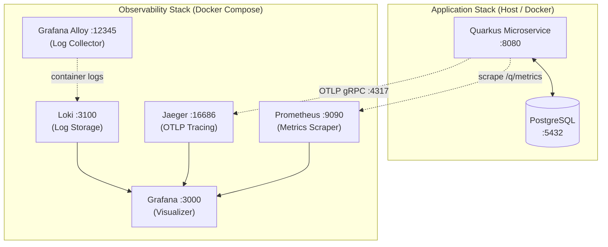

# Quarkus Microservice Gold Template

[](https://www.oracle.com/java/technologies/downloads/)
[](https://quarkus.io)
[](LICENSE)
[](https://github.com/chrom/quarkus-ms-gold-template/actions/workflows/openapi-contract.yml)

An enterprise-grade reference microservice template for building production-ready Java services with **Quarkus**. This project is hosted at [github.com/chrom/quarkus-ms-gold-template](https://github.com/chrom/quarkus-ms-gold-template) and serves as a "Gold Template" (Template Metadata in Backstage) including pre-configured observability, persistence, and testing stacks.

---

## 🚀 Key Features

- **Java 25** (see `pom.xml`; Java 21+ compatible): modern bytecode and tooling.
- **Persistence**: Hibernate ORM with Panache, PostgreSQL support, and Flyway migrations.
- **REST API**: Jackson-powered JSON serialization; pagination via query parameters and typed page wrappers (see catalog resources).
- **Catalog slice (reference)**: Ports & adapters under `org.acme.catalog` — domain isolated from JPA/REST; **ArchUnit** enforces domain dependency rules (requires **ArchUnit 1.4.1+** on Java 25). See [ADR 0007](docs/adr/0007-catalog-hexagonal-slice.md).
- **Full Observability Stack**:
  - **Metrics**: Micrometer with Prometheus registry.
  - **Tracing**: OpenTelemetry (OTEL) integrated with Jaeger.
  - **Logging**: Structured JSON logging exported to Grafana Loki via Grafana Alloy.
  - **Dashboards**: Pre-provisioned Grafana dashboards.
- **Quality Assurance**: 
  - Automated OpenAPI spec generation & validation.
  - **GitHub Actions**: [`openapi-contract.yml`](.github/workflows/openapi-contract.yml) — committed `openapi/openapi.yaml` must match prod codegen; **Spectral** lint (`.spectral.yaml`); PRs are checked for **breaking** changes vs the merge base (`oasdiff`).
  - Integration testing with RestAssured.
  - Load testing scenarios using **k6**.
- **Internal Course**: Includes a structured advanced Quarkus course (available in `docs/quarkus-course/`).
- **Optional OIDC**: Activate build profile `secured` with `dev` or `prod` for JWT validation (`/api/secured/me`) — see [`docs/security/oidc-secured-profile.md`](docs/security/oidc-secured-profile.md); `make dev-secured`.

---

## 🏗 Architecture

**Application structure:** The template stays **pragmatic layered Quarkus** by default (ADR 0001). The **catalog** bounded context adds a **hexagonal-style** layout: `domain` → `application` (ports + services) → `adapter.in.rest` / `adapter.out.*`, so HTTP/JSON and JPA stay at the edges. Full rationale is in [ADR 0007](docs/adr/0007-catalog-hexagonal-slice.md).

**Distributed traces (e.g. Jaeger):** span durations in the UI are shown in **microseconds (µs)**; OTLP export uses nanosecond precision internally.

The following diagram illustrates the interaction between the Quarkus application and the local observability infrastructure provided in this template.



---

## 🛠 Getting Started

### Prerequisites

- **Java 21** or later
- **Docker** and **Docker Compose**
- **GNU Make** (recommended for ease of use)

### 1. Local Development (App only)

Run the application in development mode with live coding:

```bash
./mvnw quarkus:dev
```

- **Swagger UI**: [http://localhost:8080/q/swagger-ui](http://localhost:8080/q/swagger-ui)
- **Health Checks**: [http://localhost:8080/q/health](http://localhost:8080/q/health)

### 2. Monitoring & Infrastructure

To start the local observability stack (Prometheus, Grafana, Jaeger, Loki):

```bash
make up-metrics
```

- **Grafana**: [http://localhost:3000](http://localhost:3000) (User: `admin`, Pass: `admin`)
- **Prometheus**: [http://localhost:9090](http://localhost:9090)
- **Jaeger UI**: [http://localhost:16686](http://localhost:16686)

### 3. Running the Full Production Stack

To build a native image (optional) and run everything in containers:

```bash
make up-prod
```

---

## 📄 OpenAPI Mastery

This template strictly enforces OpenAPI standards.

- **Generation**: Specs are automatically generated from code using SmallRye OpenAPI.
- **Validation**: Specifications are validated against OpenAPI 3.x standards using Dockerized tools.
- **Commands**:
  - `make openapi-generate-prod`: Regenerate **prod** `openapi/openapi.yaml` (+ JSON if enabled) — **run after REST/OpenAPI changes** before commit (see [`docs/api/versioning.md`](docs/api/versioning.md)).
  - `make openapi-generate`: Export both **dev** and **prod** specs to `openapi/`.
  - `make openapi-validate`: Validate the generated specs (structural).
  - `make openapi-spectral`: [Spectral](https://stoplight.io/open-source/spectral) lint on prod spec (same rules as CI; `.spectral.yaml`).
  - `make openapi-check-sync`: Same **sync** check as CI (committed prod spec == `mvn` codegen).
  - `make openapi-diff`: Comparison between `dev` and `prod` specs.
- **Versioning policy** (incl. prod regen): [`docs/api/versioning.md`](docs/api/versioning.md)

---

## 📈 Load Testing

Load tests are located in `load-tests/k6/`. You can run them via Docker without installing k6 locally:

```bash
make load-test-docker VUS=50 DURATION=5m
```

---

## 🏗 Shared infrastructure (optional)

Platform bootstrap (Keycloak/OIDC, compose, realm) lives in a **sibling directory** next to this repo, not inside it — see [`docs/infra/README.md`](docs/infra/README.md) for the canonical layout (e.g. `test_q/infra-bootstrap/` alongside `test_q/quarkus-ms-gold-template`).

---

## 🎓 Internal Education

The documentation includes a deep-dive **Quarkus Course** (Ukrainian) for Senior/Middle developers:
- [Course Contents](docs/quarkus-course/README.md)
- [Architecture Decision Records (ADR)](docs/adr/) — start with [ADR 0001](docs/adr/0001-gold-template-concept.md), [ADR 0007](docs/adr/0007-catalog-hexagonal-slice.md) (catalog), and [ADR 0008](docs/adr/0008-platform-evolution-roadmap.md) (planned next capabilities: security, contract CI, versioning, idempotency/events, multitenancy, compliance, rate limiting)
- [Roadmap docs](docs/roadmap/) — e.g. [event-driven orchestration backlog](docs/roadmap/event-driven-orchestration.md) (Phase G detail)
- [Observability Guide](docs/observability/)

---

## 📦 Makefile Reference

| Command | Description |
|---------|-------------|
| `make help` | Show all available commands |
| `make dev` | Run app in dev mode (live coding) |
| `make up-metrics` | Start monitoring stack only |
| `make up-prod` | Start app + DB in prod mode |
| `make status` | Check status of all containers |
| `make logs-app` | Tail application logs |
| `make clean-all` | Full cleanup of all Docker resources |

---

Developed for **Internal Developer Portal (IDP)**.  
Maintainer: @recruiter_wb_vita
