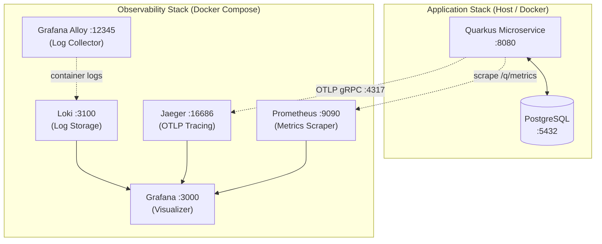

# Quarkus Microservice Gold Template

[](https://www.oracle.com/java/technologies/downloads/)
[](https://quarkus.io)
[](LICENSE)
[](https://github.com/chrom/quarkus-ms-gold-template/actions/workflows/openapi-contract.yml)

An enterprise-grade reference microservice template for building production-ready Java services with **Quarkus**. This project is hosted at [github.com/chrom/quarkus-ms-gold-template](https://github.com/chrom/quarkus-ms-gold-template) and serves as a "Gold Template" (Template Metadata in Backstage) including pre-configured observability, persistence, and testing stacks.

---

## 🚀 Key Features

- **Java 25** (see `pom.xml`; Java 21+ compatible): modern bytecode and tooling.
- **Persistence**: Hibernate ORM with Panache, PostgreSQL support, and Flyway migrations.
- **REST API**: Jackson-powered JSON serialization; pagination via query parameters and typed page wrappers (see catalog resources).
- **Catalog slice (reference)**: Ports & adapters under `org.acme.catalog` — domain isolated from JPA/REST; **ArchUnit** enforces domain dependency rules (requires **ArchUnit 1.4.1+** on Java 25). See [ADR 0007](docs/adr/0007-catalog-hexagonal-slice.md).
- **Full Observability Stack**:
  - **Metrics**: Micrometer with Prometheus registry.
  - **Tracing**: OpenTelemetry (OTEL) integrated with Jaeger.
  - **Logging**: Structured JSON logging exported to Grafana Loki via Grafana Alloy.
  - **Dashboards**: Pre-provisioned Grafana dashboards.
- **Quality Assurance**: 
  - Automated OpenAPI spec generation & validation.
  - **GitHub Actions**: [`openapi-contract.yml`](.github/workflows/openapi-contract.yml) — committed `openapi/openapi.yaml` must match prod codegen; **Spectral** lint (`.spectral.yaml`); PRs are checked for **breaking** changes vs the merge base (`oasdiff`).
  - Integration testing with RestAssured.
  - Load testing scenarios using **k6**.
- **Optional OIDC**: Activate build profile `secured` with `dev` or `prod` for JWT validation (`/api/secured/me`) — see [`docs/security/oidc-secured-profile.md`](docs/security/oidc-secured-profile.md); `make dev-secured`.

---

## 🏗 Architecture

**Application structure:** The template stays **pragmatic layered Quarkus** by default (ADR 0001). The **catalog** bounded context adds a **hexagonal-style** layout: `domain` → `application` (ports + services) → `adapter.in.rest` / `adapter.out.*`, so HTTP/JSON and JPA stay at the edges. Full rationale is in [ADR 0007](docs/adr/0007-catalog-hexagonal-slice.md).

**Distributed traces (e.g. Jaeger):** span durations in the UI are shown in **microseconds (µs)**; OTLP export uses nanosecond precision internally.

The following diagram illustrates the interaction between the Quarkus application and the local observability infrastructure provided in this template.



---

## 🛠 Getting Started

### Prerequisites

- **Java 21** or later
- **Docker** and **Docker Compose**
- **GNU Make** (recommended for ease of use)

### 1. Local Development (App only)

Run the application in development mode with live coding:

```bash
./mvnw quarkus:dev
```

- **Swagger UI**: [http://localhost:8080/q/swagger-ui](http://localhost:8080/q/swagger-ui)
- **Health Checks**: [http://localhost:8080/q/health](http://localhost:8080/q/health)

### 2. Monitoring & Infrastructure

To start the local observability stack (Prometheus, Grafana, Jaeger, Loki):

```bash
make up-metrics
```

- **Grafana**: [http://localhost:3000](http://localhost:3000) (User: `admin`, Pass: `admin`)
- **Prometheus**: [http://localhost:9090](http://localhost:9090)
- **Jaeger UI**: [http://localhost:16686](http://localhost:16686)

### 3. Running the Full Production Stack

To build a native image (optional) and run everything in containers:

```bash
make up-prod
```

### 4. Deploying to Kubernetes (Helm)

The chart under `deploy/helm/` ships with hardened defaults: restricted Pod Security
Standards (`runAsNonRoot`, `readOnlyRootFilesystem`, all capabilities dropped),
a `PodDisruptionBudget`, and an env-split `NetworkPolicy` that is **off** in
`values.yaml` (k3d/flannel does not enforce NetworkPolicy) and **on** in
`values-stage.yaml` / `values-prod.yaml`. See [ADR 0010](docs/adr/0010-runtime-hardening-and-network-policy.md).

```bash
# local k3d (NetworkPolicy off, postgresql subchart on)
helm upgrade --install my-svc deploy/helm -f deploy/helm/values.yaml

# stage / prod — image tag and OIDC values must come from your pipeline
helm upgrade --install my-svc deploy/helm \
  -f deploy/helm/values.yaml -f deploy/helm/values-prod.yaml \
  --set image.tag="$GIT_SHA" \
  --set oidc.authServerUrl="https://kc.example.com/realms/prod" \
  --set oidc.clientId="my-svc-api"
```

**Routing (Host → Service) is NOT done by this chart.** The platform owns that
surface via Gateway API (Envoy Gateway + `HTTPRoute`) in the `infra-bootstrap`
repo. This chart renders a `ClusterIP` `Service`; to expose the service externally,
add an `HTTPRoute` in `infra-bootstrap/k8s/gateway/routes/` that targets the
`Service` name rendered by this release. This keeps routing policy centralised and
prevents silent `Ingress ↔ HTTPRoute` drift.

---

## 📄 OpenAPI Mastery

This template strictly enforces OpenAPI standards.

- **Generation**: Specs are automatically generated from code using SmallRye OpenAPI.
- **Validation**: Specifications are validated against OpenAPI 3.x standards using Dockerized tools.
- **Commands**:
  - `make openapi-generate-prod`: Regenerate **prod** `openapi/openapi.yaml` (+ JSON if enabled) — **run after REST/OpenAPI changes** before commit (see [`docs/api/versioning.md`](docs/api/versioning.md)).
  - `make openapi-generate`: Export both **dev** and **prod** specs to `openapi/`.
  - `make openapi-validate`: Validate the generated specs (structural).
  - `make openapi-spectral`: [Spectral](https://stoplight.io/open-source/spectral) lint on prod spec (same rules as CI; `.spectral.yaml`).
  - `make openapi-check-sync`: Same **sync** check as CI (committed prod spec == `mvn` codegen).
  - `make openapi-diff`: Comparison between `dev` and `prod` specs.
- **Versioning policy** (incl. prod regen): [`docs/api/versioning.md`](docs/api/versioning.md)

---

## 📈 Load Testing

Load tests are located in `load-tests/k6/`. You can run them via Docker without installing k6 locally:

```bash
make load-test-docker VUS=50 DURATION=5m
```

---

## 🏗 Shared infrastructure (optional)

Platform bootstrap (Keycloak/OIDC, compose, realm) lives in a **sibling directory** next to this repo, not inside it — see [`docs/infra/README.md`](docs/infra/README.md) for the canonical layout (e.g. `test_q/infra-bootstrap/` alongside `test_q/quarkus-ms-gold-template`).

---

## ✅ Post-setup checklist (after cloning this template)

This template ships with a fully-wired CI pipeline but intentionally leaves a few integration points as **explicit opt-ins**. Work through this checklist the first time you clone the template into a new service:

### 1. Container registry

Image publishing in [`.github/workflows/ci.yaml`](.github/workflows/ci.yaml) and [`.github/workflows/release.yaml`](.github/workflows/release.yaml) is currently a **dry run** — images are built and scanned locally in the runner but not pushed. Search for `TODO(registry):` markers and enable push once the target registry is chosen.

Steps:

1. Decide on the registry (ghcr.io recommended for GitHub-hosted repos; Harbor/ECR/GitLab also supported).
2. Create credentials and store as repository/organisation secrets:
   - `REGISTRY_USERNAME` (or rely on `GITHUB_TOKEN` for ghcr.io).
   - `REGISTRY_PASSWORD` / `REGISTRY_TOKEN`.
3. In `ci.yaml` and `release.yaml`, replace `push: false` with `push: true` and add the registry prefix to `tags:`.
4. Add a `docker/login-action@v3` step before each build.

### 2. SonarQube analysis

The `sonar` job in `ci.yaml` is **conditional on `vars.SONAR_HOST_URL`** — it skips silently until the variable is defined. Quality Gate outcome becomes part of `ci-passed` once enabled.

Steps:

1. Provision the SonarQube server (see [`docs/infra/sonarqube-setup.md`](docs/infra/sonarqube-setup.md) for the `infra-bootstrap` Helm chart and ArgoCD wiring).
2. In SonarQube UI: create project `quarkus-ms-gold-template`, generate an analysis token.
3. In GitHub repository settings:
   - Add variable: `SONAR_HOST_URL` = e.g. `https://sonar.internal.example.com`.
   - Add secret: `SONAR_TOKEN` = the analysis token.
4. Push any commit — the `sonar` job activates automatically.

Tune coverage thresholds and exclusions in [`sonar-project.properties`](sonar-project.properties).

### 3. Dependabot

[`.github/dependabot.yml`](.github/dependabot.yml) watches Maven, GitHub Actions, and Docker base images. It needs **no extra configuration** — GitHub enables it automatically once the file is committed. PRs arrive weekly (grouped by ecosystem to reduce noise) and security updates bypass the schedule.

### 4. Branch protection

Point the required status check at the **aggregation job** `ci-passed` (not individual child jobs). This keeps branch protection stable as the pipeline evolves:

- Settings → Branches → Branch protection rules → `main`.
- Require status checks: `ci-passed`, `contract` (from `openapi-contract.yml`).
- Require branches to be up to date before merging.

### 5. Supply-chain artefacts

Every successful build on `main` produces a **CycloneDX SBOM** (`target/bom.json` + `bom.xml`). Release tags attach the SBOM to the GitHub Release page alongside the native runner binary and the native container tarball.

To verify artefacts locally:

```bash
./mvnw -ntp package                  # generates target/bom.json + bom.xml
jq '.components | length' target/bom.json
```

---

## 🎓 Documentation

- [Architecture Decision Records (ADR)](docs/adr/) — start with [ADR 0001](docs/adr/0001-gold-template-concept.md), [ADR 0007](docs/adr/0007-catalog-hexagonal-slice.md) (catalog), and [ADR 0008](docs/adr/0008-platform-evolution-roadmap.md) (planned next capabilities: security, contract CI, versioning, idempotency/events, multitenancy, compliance, rate limiting)
- [Roadmap docs](docs/roadmap/) — e.g. [event-driven orchestration backlog](docs/roadmap/event-driven-orchestration.md) (Phase G detail)
- [Observability Guide](docs/observability/)

---

## 📦 Makefile Reference

| Command | Description |
|---------|-------------|
| `make help` | Show all available commands |
| `make dev` | Run app in dev mode (live coding) |
| `make up-metrics` | Start monitoring stack only |
| `make up-prod` | Start app + DB in prod mode |
| `make status` | Check status of all containers |
| `make logs-app` | Tail application logs |
| `make clean-all` | Full cleanup of all Docker resources |

---

Developed for **Internal Developer Portal (IDP)**.  
Maintainer: @recruiter_wb_vita
