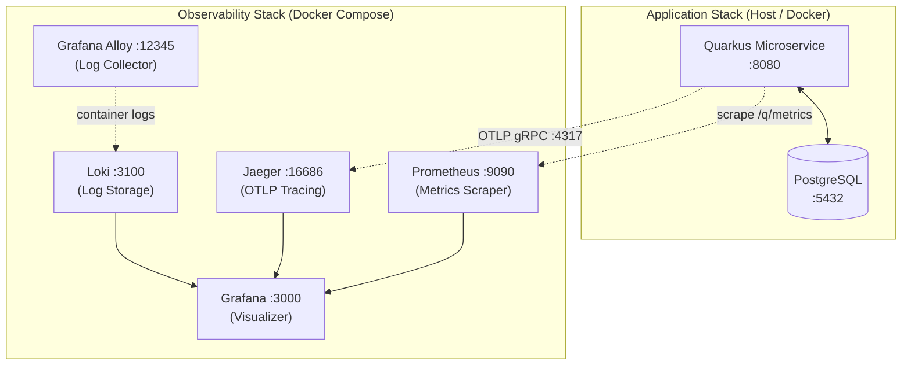

# Quarkus Microservice Gold Template

[](https://www.oracle.com/java/technologies/downloads/)
[](https://quarkus.io)
[](LICENSE)
[](https://github.com/chrom/quarkus-ms-gold-template/actions/workflows/openapi-contract.yml)

An enterprise-grade reference microservice template for building production-ready Java services with **Quarkus**. This project is hosted at [github.com/chrom/quarkus-ms-gold-template](https://github.com/chrom/quarkus-ms-gold-template) and serves as a "Gold Template" (Template Metadata in Backstage) including pre-configured observability, persistence, and testing stacks.

---

## 🚀 Key Features

- **Modern Java/Quarkus baseline**: Java 25 toolchain, Quarkus 3.34.x, Maven Wrapper, RESTEasy Reactive, Jackson, Hibernate ORM with Panache, Flyway, PostgreSQL, validation, health checks, metrics, and OpenAPI.
- **Reference business slice**: a small catalog bounded context under `org.acme.catalog` that demonstrates a pragmatic hexagonal layout: domain model, application ports/services, inbound REST adapter, outbound persistence/recommendation adapters. See [ADR 0007](docs/adr/0007-catalog-hexagonal-slice.md).
- **API contract discipline**: generated OpenAPI is committed, checked for drift, linted with Spectral, and compared for breaking changes on PRs with `oasdiff`.
- **Uniform error contract**: every 4xx/5xx response uses RFC 7807 `application/problem+json` with one shared `Problem` schema, centralised mappers, request-id correlation, OpenAPI normalisation, and Spectral enforcement. See [ADR 0012](docs/adr/0012-api-error-contract-problem-details.md).
- **Production observability**: Micrometer + Prometheus metrics, OpenTelemetry traces, Jaeger UI, structured JSON logs, Grafana Alloy, Loki, and pre-provisioned Grafana dashboards.
- **Testing baseline**: unit tests, RestAssured API tests, ArchUnit architecture tests, PostgreSQL-backed integration tests via Testcontainers, Flyway migration verification, and k6 load-test scenarios.
- **CI / supply-chain baseline**: GitHub Actions build/test pipeline, JaCoCo coverage, CycloneDX SBOM, Trivy image scanning, conditional SonarQube analysis, Dependabot, OpenAPI contract workflow, and tag-based release workflow. See [ADR 0009](docs/adr/0009-ci-supply-chain-baseline.md).
- **Container and Kubernetes readiness**: JVM and native Dockerfiles, local k3d registry helpers, Helm chart, Pod Security Standards-compatible runtime hardening, `PodDisruptionBudget`, env-split `NetworkPolicy`, and Gateway API-oriented routing ownership. See [ADR 0010](docs/adr/0010-runtime-hardening-and-network-policy.md).
- **Optional OIDC profile**: activate the `secured` build profile for JWT validation and the reference `/api/secured/me` endpoint. See [`docs/security/oidc-secured-profile.md`](docs/security/oidc-secured-profile.md) and `make dev-secured`.

---

## ✅ What Is Included In The Gold Template

This repository is intended to be cloned as the starting point for a production-grade Quarkus microservice. It is not just a demo app: the template encodes engineering decisions, local-development workflows, CI gates, operational defaults, and future extension points.

| Area | Included capability | Main files |
|------|---------------------|------------|
| **Runtime** | Quarkus app with REST API, JSON serialization, validation, health checks, OpenAPI, metrics, and PostgreSQL persistence. | `pom.xml`, `src/main/resources/application.properties`, `src/main/java/org/acme` |
| **Domain architecture** | Catalog bounded context with ports/adapters and ArchUnit guardrails so domain code does not drift into REST/JPA concerns. | `src/main/java/org/acme/catalog`, `src/test/java/org/acme/*Architecture*Test.java`, `docs/adr/0007-catalog-hexagonal-slice.md` |
| **Database** | Flyway migrations, PostgreSQL configuration, prod schema validation, and Testcontainers-backed integration tests. | `src/main/resources/db/migration`, `src/test/java`, `docs/adr/0005-database-migrations.md`, `docs/adr/0011-integration-tests-on-postgres-via-testcontainers.md` |
| **HTTP API contract** | OpenAPI generation, committed contract snapshot, sync gate, Spectral lint, `oasdiff` breaking-change check, API versioning guidance. | `openapi/openapi.yaml`, `.spectral.yaml`, `.github/workflows/openapi-contract.yml`, `docs/api/versioning.md` |
| **Error handling** | One RFC 7807 `ProblemDetail` body for all errors, centralised mappers, `requestId` correlation, and OpenAPI/Spectral enforcement. | `src/main/java/org/acme/rest/error`, `src/main/java/org/acme/openapi/ProblemDetailsOASFilter.java`, `docs/adr/0012-api-error-contract-problem-details.md` |
| **Security baseline** | Threat-model lite, optional OIDC secured profile, pod/container hardening, stdout-only prod logging, NetworkPolicy for stage/prod. | `docs/security`, `deploy/helm`, `docs/adr/0010-runtime-hardening-and-network-policy.md` |
| **Observability** | Prometheus, Grafana, Jaeger, Loki, Grafana Alloy, structured logs, dashboards, and verification commands. | `deploy/docker-compose-metrics.yml`, `grafana/`, `deploy/helm/files/dashboards`, `docs/observability` |
| **Quality gates** | Unit/integration tests, ArchUnit, coverage, OpenAPI checks, Helm render checks, image scan, SBOM, and optional SonarQube Quality Gate. | `Makefile`, `.github/workflows/ci.yaml`, `sonar-project.properties` |
| **Supply chain** | CycloneDX SBOM (`target/bom.json` / `bom.xml`), Trivy CVE scanning, Dependabot grouped updates for Maven, actions, and Docker images. | `.github/dependabot.yml`, `pom.xml`, `.github/workflows/ci.yaml` |
| **Kubernetes delivery** | Helm chart with stage/prod values, PSS-restricted security context, `emptyDir` writable paths, `PodDisruptionBudget`, and `NetworkPolicy`. | `deploy/helm`, `docs/adr/0010-runtime-hardening-and-network-policy.md` |
| **Platform integration** | Clear boundary with sibling `infra-bootstrap`: Gateway API routing, Keycloak/OIDC, SonarQube, and future reusable workflows live at platform level. | `docs/infra`, `docs/adr/0009-ci-supply-chain-baseline.md` |

The guiding rule is: **service-specific behaviour stays in this repository; platform-wide routing, identity, shared CI primitives, and shared infrastructure live in `infra-bootstrap`.**

---

## 🏗 Architecture

**Application structure:** The template stays **pragmatic layered Quarkus** by default (ADR 0001). The **catalog** bounded context adds a **hexagonal-style** layout: `domain` → `application` (ports + services) → `adapter.in.rest` / `adapter.out.*`, so HTTP/JSON and JPA stay at the edges. Full rationale is in [ADR 0007](docs/adr/0007-catalog-hexagonal-slice.md).

**Distributed traces (e.g. Jaeger):** span durations in the UI are shown in **microseconds (µs)**; OTLP export uses nanosecond precision internally.

The following diagram illustrates the interaction between the Quarkus application and the local observability infrastructure provided in this template.


```mermaid
flowchart TB
  subgraph App["Application Stack (Host / Docker)"]
    Q["Quarkus Microservice\n:8080"]
    DB[("PostgreSQL\n:5432")]
  end

  subgraph Obs["Observability Stack (Docker Compose)"]
    PR["Prometheus :9090\n(Metrics Scraper)"]
    JA["Jaeger :16686\n(OTLP Tracing)"]
    AL["Grafana Alloy :12345\n(Log Collector)"]
    LO["Loki :3100\n(Log Storage)"]
    GR["Grafana :3000\n(Visualizer)"]
  end

  Q <--> DB
  Q -.->|scrape /q/metrics| PR
  Q -.->|OTLP gRPC :4317| JA
  AL -.->|container logs| LO
  
  PR --> GR
  LO --> GR
  JA --> GR
```

---

## 🛠 Getting Started

### Prerequisites

- **Java 25** or later
- **Docker** and **Docker Compose**
- **GNU Make** (recommended for ease of use)

### 1. Local Development (App only)

Run the application in development mode with live coding:

```bash
./mvnw quarkus:dev
```

- **Swagger UI**: [http://localhost:8080/q/swagger-ui](http://localhost:8080/q/swagger-ui)
- **Health Checks**: [http://localhost:8080/q/health](http://localhost:8080/q/health)

### 2. Monitoring & Infrastructure

To start the local observability stack (Prometheus, Grafana, Jaeger, Loki):

```bash
make up-metrics
```

- **Grafana**: [http://localhost:3000](http://localhost:3000) (User: `admin`, Pass: `admin`)
- **Prometheus**: [http://localhost:9090](http://localhost:9090)
- **Jaeger UI**: [http://localhost:16686](http://localhost:16686)

### 3. Running the Full Production Stack

To build a native image (optional) and run everything in containers:

```bash
make up-prod
```

### 4. Deploying to Kubernetes (Helm)

The chart under `deploy/helm/` ships with hardened defaults: restricted Pod Security
Standards (`runAsNonRoot`, `readOnlyRootFilesystem`, all capabilities dropped),
a `PodDisruptionBudget`, and an env-split `NetworkPolicy` that is **off** in
`values.yaml` (k3d/flannel does not enforce NetworkPolicy) and **on** in
`values-stage.yaml` / `values-prod.yaml`. See [ADR 0010](docs/adr/0010-runtime-hardening-and-network-policy.md).

```bash
# local k3d (NetworkPolicy off, postgresql subchart on)
helm upgrade --install my-svc deploy/helm -f deploy/helm/values.yaml

# stage / prod — image tag and OIDC values must come from your pipeline
helm upgrade --install my-svc deploy/helm \
  -f deploy/helm/values.yaml -f deploy/helm/values-prod.yaml \
  --set image.tag="$GIT_SHA" \
  --set oidc.authServerUrl="https://kc.example.com/realms/prod" \
  --set oidc.clientId="my-svc-api"
```

**Routing (Host → Service) is NOT done by this chart.** The platform owns that
surface via Gateway API (Envoy Gateway + `HTTPRoute`) in the `infra-bootstrap`
repo. This chart renders a `ClusterIP` `Service`; to expose the service externally,
add an `HTTPRoute` in `infra-bootstrap/k8s/gateway/routes/` that targets the
`Service` name rendered by this release. This keeps routing policy centralised and
prevents silent `Ingress ↔ HTTPRoute` drift.

---

## 📄 OpenAPI Mastery

This template strictly enforces OpenAPI standards.

- **Generation**: Specs are automatically generated from code using SmallRye OpenAPI.
- **Validation**: Specifications are validated against OpenAPI 3.x standards using Dockerized tools.
- **Commands**:
  - `make openapi-generate-prod`: Regenerate **prod** `openapi/openapi.yaml` (+ JSON if enabled) — **run after REST/OpenAPI changes** before commit (see [`docs/api/versioning.md`](docs/api/versioning.md)).
  - `make openapi-generate`: Export both **dev** and **prod** specs to `openapi/`.
  - `make openapi-validate`: Validate the generated specs (structural).
  - `make openapi-spectral`: [Spectral](https://stoplight.io/open-source/spectral) lint on prod spec (same rules as CI; `.spectral.yaml`).
  - `make openapi-check-sync`: Same **sync** check as CI (committed prod spec == `mvn` codegen).
  - `make openapi-diff`: Comparison between `dev` and `prod` specs.
- **Versioning policy** (incl. prod regen): [`docs/api/versioning.md`](docs/api/versioning.md)

---

## 📈 Load Testing

Load tests are located in `load-tests/k6/`. You can run them via Docker without installing k6 locally:

```bash
make load-test-docker VUS=50 DURATION=5m
```

---

## 🏗 Shared infrastructure (optional)

Platform bootstrap (Keycloak/OIDC, compose, realm) lives in a **sibling directory** next to this repo, not inside it — see [`docs/infra/README.md`](docs/infra/README.md) for the canonical layout (e.g. `test_q/infra-bootstrap/` alongside `test_q/quarkus-ms-gold-template`).

---

## ✅ Post-setup checklist (after cloning this template)

This template ships with a fully-wired CI pipeline but intentionally leaves a few integration points as **explicit opt-ins**. Work through this checklist the first time you clone the template into a new service:

### 1. Container registry

Image publishing in [`.github/workflows/ci.yaml`](.github/workflows/ci.yaml) and [`.github/workflows/release.yaml`](.github/workflows/release.yaml) is currently a **dry run** — images are built and scanned locally in the runner but not pushed. Search for `TODO(registry):` markers and enable push once the target registry is chosen.

Steps:

1. Decide on the registry (ghcr.io recommended for GitHub-hosted repos; Harbor/ECR/GitLab also supported).
2. Create credentials and store as repository/organisation secrets:
   - `REGISTRY_USERNAME` (or rely on `GITHUB_TOKEN` for ghcr.io).
   - `REGISTRY_PASSWORD` / `REGISTRY_TOKEN`.
3. In `ci.yaml` and `release.yaml`, replace `push: false` with `push: true` and add the registry prefix to `tags:`.
4. Add a `docker/login-action@v3` step before each build.

### 2. SonarQube analysis

The `sonar` job in `ci.yaml` is **conditional on `vars.SONAR_HOST_URL`** — it skips silently until the variable is defined. Quality Gate outcome becomes part of `ci-passed` once enabled.

Steps:

1. Provision the SonarQube server (see [`docs/infra/sonarqube-setup.md`](docs/infra/sonarqube-setup.md) for the `infra-bootstrap` Helm chart and ArgoCD wiring).
2. In SonarQube UI: create project `quarkus-ms-gold-template`, generate an analysis token.
3. In GitHub repository settings:
   - Add variable: `SONAR_HOST_URL` = e.g. `https://sonar.internal.example.com`.
   - Add secret: `SONAR_TOKEN` = the analysis token.
4. Push any commit — the `sonar` job activates automatically.

Tune coverage thresholds and exclusions in [`sonar-project.properties`](sonar-project.properties).

### 3. Dependabot

[`.github/dependabot.yml`](.github/dependabot.yml) watches Maven, GitHub Actions, and Docker base images. It needs **no extra configuration** — GitHub enables it automatically once the file is committed. PRs arrive weekly (grouped by ecosystem to reduce noise) and security updates bypass the schedule.

### 4. Branch protection

Point the required status check at the **aggregation job** `ci-passed` (not individual child jobs). This keeps branch protection stable as the pipeline evolves:

- Settings → Branches → Branch protection rules → `main`.
- Require status checks: `ci-passed`, `contract` (from `openapi-contract.yml`).
- Require branches to be up to date before merging.

### 5. Supply-chain artefacts

Every successful build on `main` produces a **CycloneDX SBOM** (`target/bom.json` + `bom.xml`). Release tags attach the SBOM to the GitHub Release page alongside the native runner binary and the native container tarball.

To verify artefacts locally:

```bash
./mvnw -ntp package                  # generates target/bom.json + bom.xml
jq '.components | length' target/bom.json
```

---

## 🧭 Roadmap: What Still Needs To Be Added

The template intentionally starts with a strong synchronous HTTP + PostgreSQL + operations baseline. Larger platform capabilities are tracked as future phases in [ADR 0008](docs/adr/0008-platform-evolution-roadmap.md) and should be added only when the owning service or platform actually needs them.

| Phase | Status | What remains |
|-------|--------|--------------|
| **Phase A — API contract safety** | ✅ Implemented | OpenAPI sync, Spectral, `oasdiff`, and versioning guidance are already in place. Future work: make rules stricter only when a consuming team needs a new policy. |
| **Phase A′ — Build / CI / supply chain** | ✅ Implemented | Build/test pipeline, SBOM, Trivy, Dependabot, release workflow, and conditional SonarQube wiring are present. Future work: enable real registry push after choosing `ghcr.io`, Harbor, ECR, or another registry. |
| **Phase B — Security baseline** | 🟡 Partially implemented | Implemented: threat-model lite, optional OIDC profile, runtime hardening, stdout-only prod logs, env-split NetworkPolicy. Remaining: gateway-owned rate limiting policy, stage/prod security headers, CORS template, and a role-protected business endpoint example such as `/api/admin/ping`. |
| **Phase C — Reliability patterns** | ⬜ Planned | Add `Idempotency-Key` support for mutating APIs, TTL-based deduplication storage, and later an outbox table if messaging is introduced. |
| **Phase D — Multitenancy** | ⬜ Optional | Define tenant resolution (`JWT` claim, header, or route), choose DB strategy (`tenant_id` discriminator vs PostgreSQL RLS), add cross-tenant isolation tests. Only add this when the product is truly multi-tenant. |
| **Phase E — Compliance packaging** | ⬜ Optional | Add non-binding GDPR/SOC2-style control mapping: audit log fields, retention notes, PII handling guidance, backup/restore evidence, and operator checklists. |
| **Phase F — SRE alerting** | ⬜ Planned | Convert SLO targets from ADR 0002 into Prometheus rule files or Grafana alert rules, then document notification-channel wiring for the platform/on-call tool. |
| **Phase G — Event-driven integration and orchestration** | ⬜ Planned | Add broker, async contracts, outbox, idempotent consumers, async observability, request/trace context propagation through message headers, DLQ/replay runbooks, and optional workflow-engine ADR. See [`docs/roadmap/event-driven-orchestration.md`](docs/roadmap/event-driven-orchestration.md). |

### Recommended next implementation order

1. **Finish Phase B**: rate limiting ownership at Gateway API / Envoy level, security headers, CORS template, and an AuthZ example.
2. **Add Phase F alerting**: SLOs become operational only after concrete alert rules and notification wiring exist.
3. **Add Phase C.1**: `Idempotency-Key` for mutating HTTP operations before introducing asynchronous messaging.
4. **Start Phase G only after a broker decision**: Kafka, RabbitMQ, NATS JetStream, Pulsar, or a managed platform should be selected by ADR before code is added.

### Explicitly not included yet

- No application-level rate limiter is shipped today; the current decision is to enforce request limits at the platform gateway unless a service-specific fallback is needed.
- No message broker, outbox publisher, consumer framework, or workflow engine is included today.
- No multi-tenant data model is included today.
- No compliance pack is included today.
- No production container registry push is enabled today; workflows are prepared but intentionally keep image push as a dry run until the registry is chosen.
- No self-hosted SonarQube server is deployed by this repository; deployment belongs to `infra-bootstrap`, while this repository already contains the scanner configuration and CI hook.

### Observability and debugging gaps

The current template already has HTTP-centric observability: `X-Request-Id`, OpenTelemetry traces, Micrometer metrics, JSON logs in prod, Loki, Jaeger, Prometheus, and Grafana correlation. The remaining work is to make that contract stricter and ready for asynchronous systems:

| Gap | What to add | Owner |
|-----|-------------|-------|
| **Runtime verification of log correlation** | Verify in `make up-prod` + Loki that prod JSON logs contain `requestId`, `traceId`, and `spanId`. If Quarkus/OpenTelemetry does not populate `traceId`/`spanId` in MDC for this runtime, add a small request filter/enricher that reads `Span.current().getSpanContext()` and writes those fields into MDC. | Service template |
| **Stable JSON log schema** | Move important request fields out of free-form log messages into structured fields: `event`, `method`, `path`, `status`, `durationMs`, `requestId`, `traceId`, `spanId`, `clientIp`, `userAgent`. | Service template |
| **Trace id in error responses** | Extend `ProblemDetail` with `traceId` so support/on-call can jump from a client error response directly to Jaeger/Tempo, not only through `requestId`. | Service template |
| **Span error enrichment** | Add span events/attributes for failures: `error.type`, safe `error.message`, `http.response.status_code`, and domain failure type. Do not put secrets, raw tokens, or PII into spans. | Service template |
| **Domain trace attributes** | Add low-cardinality business attributes where useful: `operation`, `product.id`, `category.id`, `outcome`. Avoid high-cardinality or sensitive values such as names, emails, full payloads, or access tokens. | Service template |
| **Alert rules as code** | Provision Prometheus rule files or Grafana alert rules for ADR 0002 SLOs: 5xx rate, p95 latency, DB pool saturation, fallback spike, target down/no metrics. | Platform + template examples |
| **Production tracing backend** | Keep Jaeger for local development, but choose Tempo or another production tracing backend in `infra-bootstrap`; the service should continue to export OTLP so the backend can change without code changes. | Platform |
| **Async context propagation** | When queues/events are introduced, propagate `requestId`, W3C `traceparent`/`tracestate`, `eventId`, `correlationId`, `causationId`, and producer metadata in message headers. | Service template + platform conventions |
| **Async dashboards and runbooks** | Add dashboards and runbooks for consumer lag, DLQ depth, replay rate, poison messages, stuck workflows, and broker availability. | Platform + service owners |

### Request id propagation through queues

When this template grows beyond synchronous HTTP, **yes — `requestId` should be propagated through queues**, but it should not replace OpenTelemetry trace context.

Recommended message-header contract:

| Header / field | Purpose |
|----------------|---------|
| `X-Request-Id` or `requestId` | Human/support-friendly correlation id that started at the edge HTTP request. Keep it stable across producers and consumers. |
| `traceparent` | W3C Trace Context header used by OpenTelemetry to continue the same distributed trace across producer → broker → consumer. |
| `tracestate` | Optional W3C vendor/context extension; propagate if present. |
| `eventId` | Unique id of this emitted event/message. Used for deduplication, DLQ, replay, and audits. |
| `correlationId` | Business/process correlation id. Often same as `requestId` for simple request-driven events, but may be an order id, saga id, or workflow id for long-running flows. |
| `causationId` | Id of the command/event that caused this event. Useful for reconstructing event chains. |
| `producer` / `eventType` / `eventVersion` | Operational metadata for debugging, compatibility checks, and runbooks. |

Rules:

1. **Do not generate new `requestId` on every queue hop** if the message was caused by an existing request. Reuse the incoming one.
2. **Do generate a new `requestId`** for scheduled/background jobs that have no upstream request.
3. **Do not manually invent `traceId`/`spanId`**. Let OpenTelemetry inject/extract `traceparent` and create spans.
4. **Always create a unique `eventId`** per message. This is not the same thing as `requestId`.
5. **Never put sensitive data in headers**: no JWTs, credentials, emails, full names, raw payload fragments, or payment data.

---

## 🎓 Documentation

- [Architecture Decision Records (ADR)](docs/adr/) — start with [ADR 0001](docs/adr/0001-gold-template-concept.md), [ADR 0007](docs/adr/0007-catalog-hexagonal-slice.md) (catalog), and [ADR 0008](docs/adr/0008-platform-evolution-roadmap.md) (planned next capabilities: security, contract CI, versioning, idempotency/events, multitenancy, compliance, rate limiting)
- [Roadmap docs](docs/roadmap/) — e.g. [event-driven orchestration backlog](docs/roadmap/event-driven-orchestration.md) (Phase G detail)
- [Observability Guide](docs/observability/)

---

## 📦 Makefile Reference

| Command | Description |
|---------|-------------|
| `make help` | Show all available commands |
| `make dev` | Run app in dev mode (live coding) |
| `make up-metrics` | Start monitoring stack only |
| `make up-prod` | Start app + DB in prod mode |
| `make status` | Check status of all containers |
| `make logs-app` | Tail application logs |
| `make clean-all` | Full cleanup of all Docker resources |

---

Developed for **Internal Developer Portal (IDP)**.  
Maintainer: @recruiter_wb_vita
