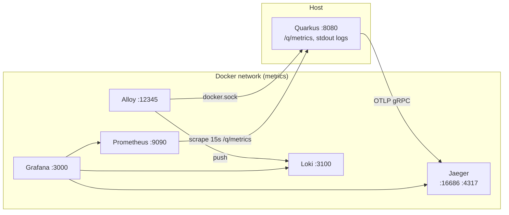
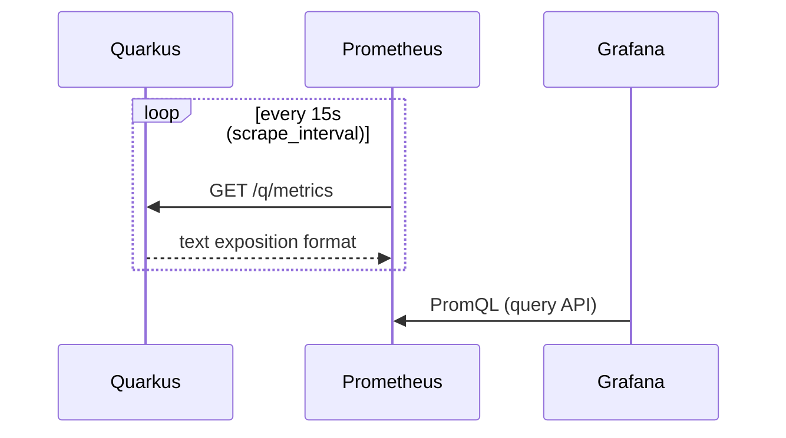
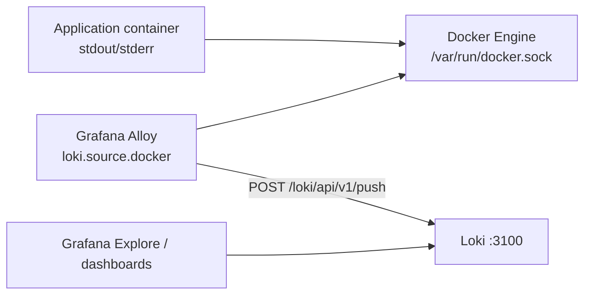
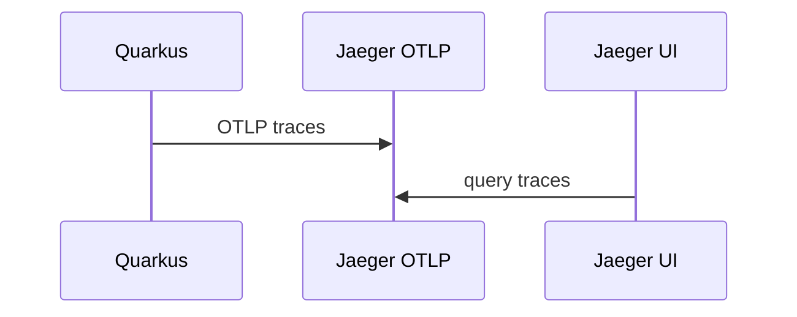
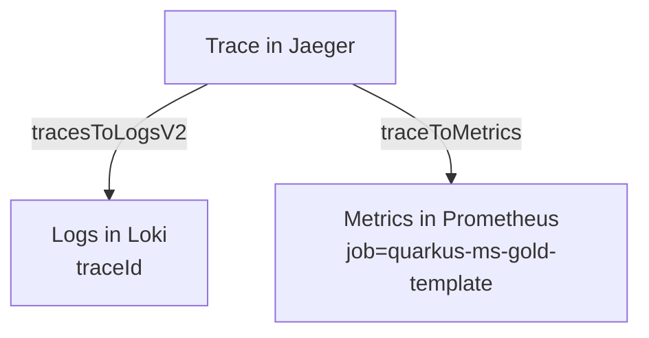

# ADR 0003: Observability Stack (Prometheus, Grafana, Loki, Alloy, Jaeger)

**Date:** 2026-04-08  
**Status:** Accepted  

## Context

The `quarkus-ms-gold-template` repository includes a local **full observability loop**: metrics for SLOs/dashboards, centralized logs, distributed traces, and correlation between them in Grafana. This ADR captures the **architectural decision**: which components are used, how they connect, where configuration lives, and how it aligns with Quarkus (Micrometer, OpenTelemetry, logging).

## Decision

The following stack and data model are adopted:

| Plane | Component | Role |
|-------|-----------|------|
| **Metrics** | Prometheus | Periodic scrape of `/q/metrics`, time-series storage |
| **Visualization** | Grafana | Dashboards, Explore, Prometheus / Loki / Jaeger datasources |
| **Logs (storage)** | Grafana Loki | Push ingest, storage, LogQL |
| **Logs (collection)** | Grafana Alloy | `loki.source.docker` → Docker API → push to Loki (replaces EOL Promtail) |
| **Traces** | Jaeger (all-in-one) | OTLP gRPC/HTTP, UI on `:16686` |
| **Application** | Quarkus | Micrometer Prometheus registry, OTLP export, JSON logs in prod |

In **prod**, the app typically runs on the host or via a separate `deploy/docker-compose.yml`; the monitoring stack is started with **`deploy/docker-compose-metrics.yml`** (compose project `metrics`), and Prometheus reaches metrics via **`host.docker.internal:8080`**.

---

## Diagram 1: Containers and network

Services from `deploy/docker-compose-metrics.yml` and external endpoints:

---

## Diagram 2: Metrics (Prometheus)

Micrometer exposes Prometheus format at **`/q/metrics`**. Prometheus issues HTTP requests on a schedule and stores samples.

**Key files:** `deploy/monitoring/prometheus.yml` (job `quarkus-ms-gold-template`, `scrape_timeout` < `scrape_interval`), `grafana/provisioning/datasources/prometheus.yaml` (`timeInterval` aligned with scrape interval).

**Metric layers in the app** (see `docs/observability/metrics-inventory.md`): Micrometer HTTP SLI, Vert.x (`http_server_active_connections`, bytes), Netty (`netty_*`), JVM / process.

---

## Diagram 3: Logs (Alloy → Loki)

Logs are **not** sent from Quarkus directly to Loki: the container writes to stdout/stderr, **Alloy** tails streams via the Docker API and pushes to Loki.

**Key files:** `grafana/alloy/config.alloy`, `deploy/monitoring/loki-config.yaml`, `deploy/docker-compose-metrics.yml` (mount `docker.sock` for Alloy).

**Limitation:** `quarkus:dev` on the host without a container does **not** reach Loki through this pipeline; for prod, use `make up-prod` and the `quarkus_prod_backend` container logs (see dashboard panels).

---

## Diagram 4: Traces (OpenTelemetry → Jaeger)

Quarkus sends traces via **OTLP** (default gRPC to Jaeger on `4317`). **Prod** uses sampling `parentbased_traceidratio` (0.25); dev/test use `always_on` (`application.properties`).

**Key files:** `src/main/resources/application.properties` (`quarkus.otel.*`), `deploy/docker-compose-metrics.yml` (ports `4317`/`4318`, `16686`).

---

## Diagram 5: Correlation in Grafana

Jaeger datasource provisioning wires **traces → logs** (Loki by `traceId`) and **traces → metrics** (Prometheus), linking all three planes in one UI.

**File:** `grafana/provisioning/datasources/jaeger.yaml`.

---

## Dashboards and provisioning

| Item | Location |
|------|----------|
| JSON dashboard “Quarkus Cloud Template — Overview” | `grafana/dashboards/quarkus-overview.json` (`uid`: `quarkus-ms-gold-template-overview`) |
| File-based provisioning | `grafana/provisioning/dashboards/default.yml` → `/var/lib/grafana/dashboards` |
| Datasources | `grafana/provisioning/datasources/*.yaml` (Prometheus, Loki, Jaeger) |

Panels: Micrometer HTTP, JVM heap, CPU, Vert.x, Netty, **two Loki panels** (backend JSON logs, PostgreSQL logs).

---

## Consequences

- **Pros:** Single OSS stack, reproducible via `make up-metrics`; clear split: metrics (Prometheus pull) vs logs (Alloy→Loki push) vs traces (OTLP push); correlation in Grafana.
- **Cons:** Prometheus depends on `host.docker.internal` reachability and `/q/metrics` latency under load; host-only processes without Docker need an extra agent for Loki; Jaeger all-in-one is not large-scale production without scaling.

## Related documents

- `docs/observability/README.md` — entry points and commands  
- `docs/observability/monitoring-optimization-plan.md` — plan and status  
- `docs/observability/metrics-inventory.md` — metric names  
- `docs/observability/logging-loki-alloy.md` — Loki + Alloy  
- ADR 0002 — SRE / production readiness (aligns with metrics and SLOs)

