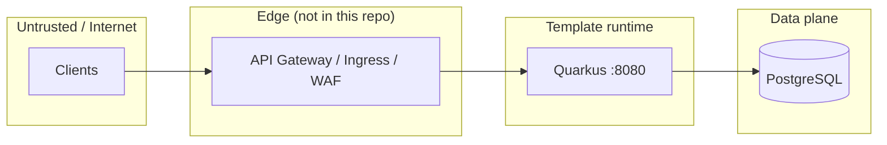

# Threat model (lite) — Gold Template

**Purpose:** One-page STRIDE view for the **quarkus-ms-gold-template** so security work stays proportional: teachable baseline first, explicit gaps second. This is **not** a full enterprise threat-modeling exercise.

**Audience:** Maintainers and teams forking the template.  
**Related:** [ADR 0001](../adr/0001-gold-template-concept.md) (baseline scope), [ADR 0008](../adr/0008-platform-evolution-roadmap.md) Phase B (security roadmap), optional [OIDC secured profile](oidc-secured-profile.md).

---

## 1. System context (assumptions)

| Element | In scope for this document |
|--------|----------------------------|
| **Deploy** | Local/dev: `./mvnw quarkus:dev`, `make up-prod` (see `deploy/docker-compose.yml`). |
| **Clients** | Browsers, scripts, other services calling HTTP on **:8080** (no API gateway in-repo). |
| **State** | PostgreSQL (catalog data, migrations via Flyway). |
| **Secrets** | Expected via env / `.env.prod` (not committed); template ships **examples** only. |
| **Out of scope** | Corporate IdP specifics, WAF/CDN rules, cluster network policies — **adopter responsibility** at the edge. |

**Trust boundaries (simplified)**

For **local development**, the boundary collapses: the developer machine often exposes **8080** directly — treat as **high trust** for the operator only, not as production topology.

---

## 2. Assets worth protecting

| Asset | Notes |
|-------|--------|
| **HTTP API** | REST catalog (`/products`, `/categories`) and demo/diagnostic endpoints (`/hello`, `/config/public`, …). |
| **Data in PostgreSQL** | Business entities (e.g. products, categories) and any future PII — **classification is product-specific**. |
| **Credentials** | DB URLs, passwords, API keys — **environment only**, never baked into images/commits. |
| **Observability** | Metrics, traces, logs may include paths, errors, correlation IDs — avoid logging bodies/secrets (see logging config). |

---

## 3. STRIDE — threats vs template (today)

Legend: **Mitigation (today)** = what the baseline or docs already assume. **Gap / next** = Phase B+ in ADR 0008 or fork work.

| STRIDE | Threat (examples) | Mitigation (today) | Gap / next |
|--------|-------------------|--------------------|------------|
| **S** Spoofing | Caller pretends to be another user or service. | **None by default** — APIs are not authenticated in the baseline (intentional for teaching). | Optional **OIDC/JWT** (Phase B); edge mTLS between services in real deployments. |
| **T** Tampering | Modify requests, JSON bodies, or DB rows in transit or at rest. | **TLS at edge** is adopter-owned; JDBC to DB in Docker network; Hibernate validates model. | Enforce **HTTPS** in prod; **integrity** for migrations (Flyway); consider **signed tokens** when auth exists. |
| **R** Repudiation | Actor denies having called **DELETE** or sensitive action. | **Structured logging** + request id filter help trace flows; not a full audit product. | Add **audit trail** (who/when) when auth lands; retention policy (Loki/GDPR) per product. |
| **I** Information disclosure | Leak data via errors, `/config/public`, Swagger, metrics, stack traces. | `/config/public` is **documented** as non-secret only; prod logging JSON; health/metrics endpoints standard for ops. | **Prod hardening**: avoid verbose errors to clients; **rate limits** (Phase B); restrict **Swagger UI** in prod if required. |
| **D** Denial of service | Flood HTTP or expensive queries to exhaust CPU/DB/threads. | Pool limits, timeouts (tune per deployment); **no app-level rate limit** in baseline. | **Gateway rate limiting** or Bucket4j (Phase B); **pagination** already on list APIs — keep for large tables. |
| **E** Elevation of privilege | Anonymous user triggers admin-only behavior. | **No roles** in baseline — single security domain “everyone can call REST”. | **RBAC** when OIDC added; never expose admin on demo endpoints in prod. |

---

## 4. Deliberate baseline choices (not bugs)

- **No authentication by default** — keeps clone-and-run simple; production services must add identity (Phase B or custom).
- **Demo and diagnostic endpoints** (`/hello`, `/bye`, parts of `/config`) — suitable for workshops; **disable or protect** in real internet-facing deployments.
- **PostgreSQL exposed** only on Docker internal network in `docker-compose`; **do not publish 5432** publicly without need.

---

## 5. What to do next (pointers)

| Priority | Action |
|----------|--------|
| **Phase B** | Follow [ADR 0008](../adr/0008-platform-evolution-roadmap.md): OIDC optional profile, rate-limiting story, security headers/CORS, prod profile tightening. |
| **Ops** | [RUNBOOK](../RUNBOOK.md) for incidents; keep secrets out of git (`.env.example` only). |
| **Fork** | Re-run this lite model when you add **auth**, **multitenancy**, or **public internet** exposure — update assets and STRIDE rows. |

---

## 6. Review cadence

Revisit this document when:

- New **external** integrations or **PII** are introduced.
- **Authentication/authorization** is added to the template.
- **Compliance** (e.g. SOC2, GDPR) becomes a requirement — extend with a formal data-flow diagram and control mapping (ADR 0008 Phase E).

**Version:** 1.0 (template) · **Last aligned with:** ADR 0008 Phase B step 1.
